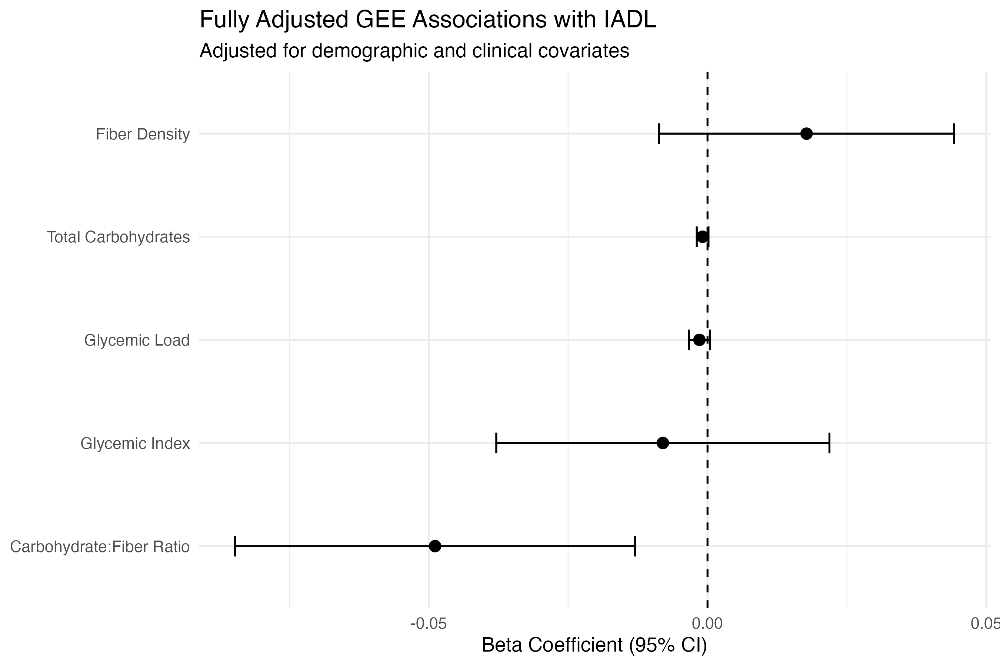
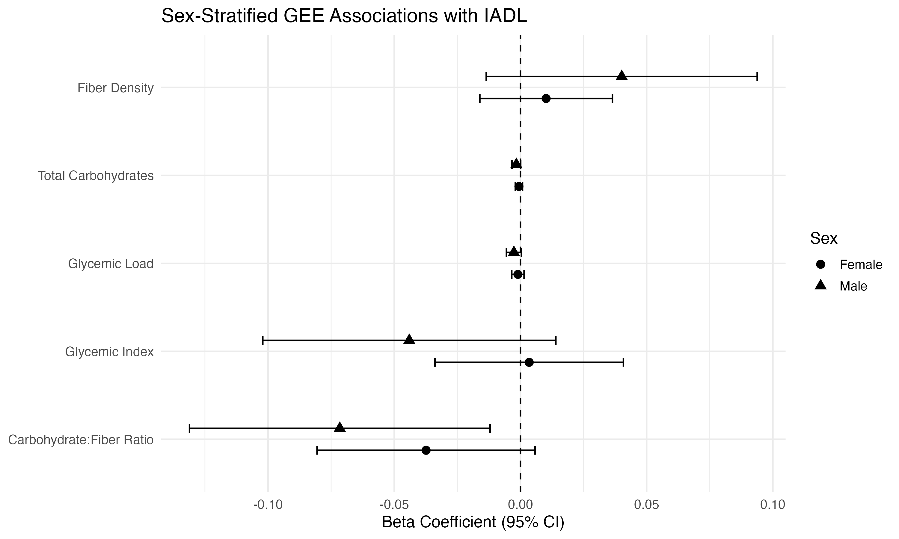

# Dietary Carbohydrate Quality and Physical Functioning
## A Longitudinal Analysis in the New England Centenarian Study

**Tools:** SAS 9.4 · R · GEE · Multi-source data harmonization  
**Data:** New England Centenarian Study (NECS) · N = 438 · Longitudinal  
**Skills demonstrated:** Novel exposure engineering · ETL pipeline · 
GEE macro development · multi-dataset harmonization · 
stratified longitudinal modeling · R visualization

---

## Overview

This project examines the relationship between dietary carbohydrate 
quality and physical functioning in older adults using longitudinal 
data from the New England Centenarian Study (NECS) — one of the 
world's largest studies of centenarians and their family members.

Six dietary carbohydrate quality exposures were derived from food 
frequency questionnaire (FFQ) data and linked to Instrumental 
Activities of Daily Living (IADL) scores across multiple study visits. 
Associations were estimated using Generalized Estimating Equations (GEE) 
across three progressively adjusted models and stratified by sex, 
diabetes status, and chronic disease burden.

This was conducted as independent graduate research at the Jean Mayer 
USDA Human Nutrition Research Center on Aging, under the supervision 
of Dr. Andres Ardisson Korat (May 2026).

---

## Research questions

1. Are dietary carbohydrate quality measures associated with 
   longitudinal IADL functioning in older adults?
2. Do associations differ by sex, diabetes status, or 
   chronic disease burden?
3. Is carbohydrate quality (fiber density, GI, GL, carb:fiber ratio) 
   more predictive than carbohydrate quantity alone?

---

## Data

- **Source:** New England Centenarian Study (NECS), Boston University
- **Access:** Restricted — available via formal data use agreement
  (see `/data/data_source.md`)
- **Analytic sample:** N = 438 after exclusion criteria
- **Structure:** Longitudinal, multiple visits per participant

**Datasets harmonized:**
FFQ · Nutrient database · Cereal standardization file · 
Demographics · IADL outcome data

---

## Exposure development

A novel carbohydrate quality index was engineered from raw FFQ data 
through a multi-stage pipeline:

1. **Cereal standardization** — Free-text cereal entries were 
   systematically reviewed and assigned to 11 standardized groups 
   based on composition and processing characteristics. GI and GL 
   values were assigned using the University of Sydney Glycemic 
   Index Research Database.

2. **Food-level calculations** — For each FFQ item: daily 
   carbohydrate intake computed, GI assigned, GL calculated as 
   `GL = (GI × carbohydrates) / 100`

3. **Participant-level exposure derivation:**
   - Dietary glycemic index (carbohydrate-weighted average GI)
   - Dietary glycemic load (sum of food-level GL)
   - Total carbohydrate intake (g/day)
   - Total dietary fiber (g/day)
   - Fiber density (g fiber per 1,000 kcal)
   - Carbohydrate-to-fiber ratio (lower = higher quality)

4. **Energy adjustment** — All exposures except fiber density 
   were energy-adjusted using the residual method

See `/code/03_exposure_construction.sas` for full derivation code.

---

## Statistical methods

**Model:** Generalized Estimating Equations (GEE)
- Normal distribution, identity link
- Exchangeable working correlation structure
- Cluster variable: participant ID
- Time variable: year of visit − year of enrollment

**Model progression:**
- Model 1: time + exposure + age + sex + education
- Model 2: Model 1 + CVD + stroke + diabetes + cancer
- Model 3: Model 2 + smoking + alcohol use

Each exposure modeled separately. Stratified analyses by sex, 
diabetes status, and chronic disease burden using Model 3 
specification. A reusable SAS macro was developed to run all 
three model specifications efficiently across all six exposures 
(see `/code/04_gee_models_macro.sas`).

---

## Key findings

- **Fiber density** was significantly associated with better IADL 
  functioning in the fully adjusted model (β = 0.70, p < 0.001)
- **Carbohydrate-to-fiber ratio** (higher = lower quality) was 
  significantly associated with lower IADL scores (β = −0.19, 
  p < 0.001), consistent across model adjustments
- **Glycemic index** showed no meaningful association across models
- **Carbohydrate quantity alone** was not a significant predictor 
  after full adjustment — quality matters more than quantity
- Sex-stratified analyses showed associations were significant 
  among **men** but not women
- Associations were strongest among participants with **existing 
  chronic disease**, potentially due to ceiling effects in the 
  disease-free group (high-functioning cohort)

---

## Analytic pipeline

```
Raw NECS datasets (FFQ, nutrients, cereal, demographics, IADL)
        ↓
01_data_cleaning.sas        — variable recoding, exclusions, QC
        ↓
02_dataset_merging.sas      — harmonize and merge 5 datasets
        ↓
03_exposure_construction.sas — derive 6 carb quality exposures
        ↓
04_gee_models_macro.sas     — run GEE models across exposures
        ↓
05_visualizations.R         — figures using ggplot2
```

---

## Repository structure

```
├── code/
│   ├── 01_data_cleaning.sas
│   ├── 02_dataset_merging.sas
│   ├── 03_exposure_construction.sas
│   ├── 04_gee_models_macro.sas
│   └── 05_visualizations.R
├── outputs/
│   ├── figure1_gee_maineffects_model3.png
│   ├── figure2_stratified_by_sex.png
│   └── figure3_stratified_by_disease.png
├── docs/
│   ├── Wallen_NECS_CarbQuality_Report.pdf
│   └── data_dictionary.md
└── data/
    └── data_source.md
```

---

## Visualizations

**Figure 1** — GEE model results: carbohydrate quality exposures 
vs. IADL (fully adjusted)



**Figure 2** — Stratified analysis by sex



**Figure 3** — Stratified analysis by chronic disease burden


---

## Author

**Olivia Wallen**  
MS, Nutrition Epidemiology and Data Science · Tufts University (2026)  
Graduate Researcher, Jean Mayer USDA HNRCA  
[LinkedIn](https://www.linkedin.com/in/olivia-wallen/) · 
[Email](mailto:oliviawallenn@gmail.com)
